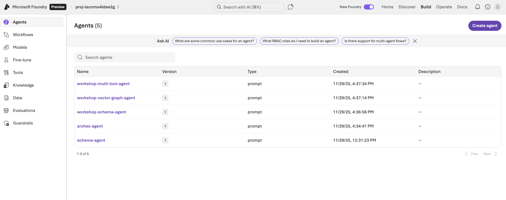

# Neo4j and Azure Foundry AI Workshop

Build AI agents that can answer complex questions about financial documents using knowledge graphs and natural language. This workshop uses **SEC Form 10-K filings** (annual reports from public companies like Apple) as source data, transforming unstructured PDF documents into a queryable knowledge graph with companies, executives, financial metrics, and risk factors.

This repository provides three ways to learn and build AI agents with Neo4j GraphRAG and the **Microsoft Agent Framework (2025)** with **Azure AI Foundry**:

1. **Interactive Workshops** ([`new-workshops/`](new-workshops/README.md)) - Jupyter notebooks and Python solutions covering retriever patterns (vector search, vector-cypher, text2cypher) and agent development with tools for schema retrieval, graph traversal, and natural language to Cypher.

2. **Complete API Server** ([`src/`](src/)) - A complete example FastAPI application exposing REST endpoints for agent status, chat, and streaming chat, using `AzureAIAgentClient` for persistent agents hosted in Azure AI Foundry.

3. **Data Pipeline** (optional) ([`data-pipeline/`](data-pipeline/README.md)) - Document processing pipeline using neo4j-graphrag-python's `SimpleKGPipeline` to parse PDFs, chunk text, generate vector embeddings, extract entities and relationships via LLM, and store everything in Neo4j as a queryable knowledge graph.

> **Note:** The data pipeline is optional. The restore command in Step 6 below loads the complete pre-processed database, so you can skip the pipeline and start with the workshops or API server immediately.

> **Workshop Participants:** If you were provided an Azure account for this workshop, you'll need to know your resource group name. Find it by searching for "Resource Groups" in the [Azure Portal](https://portal.azure.com)—it will be the only group listed. Copy this name for use during setup. If you're setting up your own environment, you can leave the resource group empty and create a new one.

[](https://codespaces.new/neo4j-partners/neo4j-azure-workshop)
[](https://vscode.dev/redirect?url=vscode://ms-vscode-remote.remote-containers/cloneInVolume?url=https://github.com/neo4j-partners/neo4j-azure-workshop)

## Quick Start

For GitHub Codespaces or Local Dev Container setup, see **[GUIDE_DEV_CONTAINERS.md](GUIDE_DEV_CONTAINERS.md)**.

## Prerequisites (Manual Setup)

*   **[uv](https://github.com/astral-sh/uv):** An extremely fast Python package installer and resolver.
*   **[Azure Developer CLI (azd)](https://learn.microsoft.com/azure/developer/azure-developer-cli/install-azd):** For infrastructure provisioning (`azd login`).
*   **[Azure CLI](https://learn.microsoft.com/cli/azure/install-azure-cli):** For authentication (`az login`).
*   **Git**

## Getting Started

### 1. Configure Azure Region
Run the setup script to select your Azure region and initialize the environment:

```bash
./scripts/setup_azure.sh
```

> **Note:** This script clears the `.azure/` directory and Azure-related settings from `.env` to ensure `azd up` creates a fresh environment. Neo4j settings in `.env` are preserved. See [docs/AZ_CLI_GUIDE.md](docs/AZ_CLI_GUIDE.md) for details on environment management.

> **Supported Regions:** `eastus2`, `swedencentral`, or `westus2`

### 2. Provision Infrastructure
Deploy the Azure AI resources:

```bash
azd up
```

> **Note:** If you encounter a `RoleAssignmentExists` error on redeployment, run `azd env set SKIP_ROLE_ASSIGNMENTS true` and then `azd up` again.

> **Note:** For full deployment options (including Container App), see [docs/AZURE_DEPLOY_GUIDE.md](docs/AZURE_DEPLOY_GUIDE.md).

### 3. Update Model Token Limits

This creates an Azure AI Foundry project with two model deployments: **gpt-4o** (for chat completions) and **text-embedding-ada-002** (for vector embeddings). Open [ai.azure.com](https://ai.azure.com/) in the same browser where you're logged into Azure to view your project.

Click **Models** in the left sidebar to see your deployments:


Click on each model and update the **Tokens per Minute Rate Limit** to increase throughput for the workshop:


See [docs/FOUNDRY_GUIDE.md](docs/FOUNDRY_GUIDE.md) for more details.

### 4. Install Dependencies
Use `uv` to sync dependencies defined in `pyproject.toml`.

```bash
uv sync --prerelease=allow
```

### 5. Setup Environment Variables
Run the helper script to pull environment variables from `azd` and create a local `.env` file.

```bash
uv run setup_env.py
```

### 6. Restore Neo4j Database (Optional)

> **Note:** If you're using a pre-provisioned workshop Neo4j database, this step is not needed—the data is already loaded.

To restore the financial graph data to your own Neo4j instance:

```bash
uv run python scripts/restore_neo4j.py
```

This streams and restores the backup from GitHub, creating:
- **Nodes:** `AssetManager`, `Company`, `Document`, `Chunk`
- **Relationships:** `OWNS`, `FILED`, `HAS_CHUNK`

The script reads Neo4j credentials (`NEO4J_URI`, `NEO4J_USERNAME`, `NEO4J_PASSWORD`) from `.env` automatically.

### 7. Build and Deploy Agents to Azure AI Foundry

**Path A: Workshop (Guided Notebooks)**
Follow the step-by-step workshop guide in [`new-workshops/`](new-workshops/README.md)

**Path B: AI Agent API Server**
Run the AI agent API server with Neo4j GraphRAG integration:

```bash
uv run uvicorn api.main:create_app --factory --reload
```

The API will be available at `http://localhost:8000`.

**Path C: Interactive Console Agent**
Run a simple interactive chat session with the agent directly in your terminal:

```bash
uv run start-agent
```

Type your messages and see streaming responses. Use `quit` or `exit` to stop.

Example:
```
You: Why is using Neo4j with Azure AI Foundry like PB & Jelly?
Agent: Neo4j and Azure AI Foundry complement each other perfectly...
```

> **Note:** After running any path, your agents will be deployed to Azure AI Foundry. You can view them by clicking **Agents** in the left sidebar at [ai.azure.com](https://ai.azure.com/):
>
> 

## Testing the AI Agent API

Run all tests to verify the AI agent endpoints are working:

```bash
uv run python src/test_server.py all
```

For individual test options and API endpoint details, see [docs/SERVER_OVERVIEW.md](docs/SERVER_OVERVIEW.md).


## Additional Documentation

| Document | Description |
|----------|-------------|
| [GUIDE_DEV_CONTAINERS.md](GUIDE_DEV_CONTAINERS.md) | GitHub Codespaces and Dev Container setup |
| [ARCHITECTURE.md](ARCHITECTURE.md) | Detailed architecture and design decisions |
| [AGENT_FRAMEWORK.md](AGENT_FRAMEWORK.md) | Microsoft Agent Framework integration notes |
| [docs/AZURE_DEPLOY_GUIDE.md](docs/AZURE_DEPLOY_GUIDE.md) | Azure deployment options (workshop vs full) |
| [docs/SERVER_OVERVIEW.md](docs/SERVER_OVERVIEW.md) | API endpoints, testing options, environment variables |
| [docs/AZ_CLI_GUIDE.md](docs/AZ_CLI_GUIDE.md) | Azure CLI reference commands |
| [docs/observability.md](docs/observability.md) | Monitoring and observability setup |
