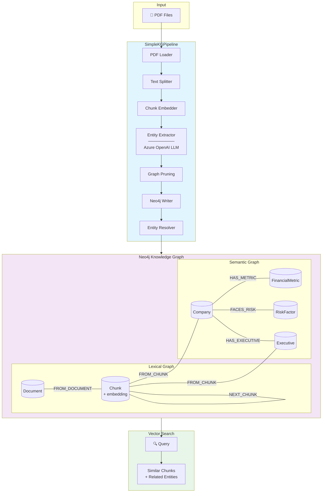

# Data Pipeline

Document processing pipeline using neo4j-graphrag-python's SimpleKGPipeline. Loads PDF files, extracts entities and relationships using Azure OpenAI, generates embeddings, and stores everything in Neo4j as a knowledge graph.

## Overview

This pipeline leverages Neo4j's official [neo4j-graphrag-python](https://github.com/neo4j/neo4j-graphrag-python) library to build a knowledge graph from PDF documents. The `SimpleKGPipeline` orchestrates 8 components that transform unstructured documents into a queryable graph with vector search capabilities.

### How It Works

The pipeline processes documents through these stages:

1. **PDF Loading** - Extracts text and metadata from PDF files
2. **Text Chunking** - Splits documents into fixed-size chunks (4000 chars, 200 overlap)
3. **Chunk Embedding** - Creates vector embeddings for semantic search
4. **Schema Definition** - Applies predefined entity/relationship types
5. **Entity Extraction** - LLM extracts entities and relationships from each chunk
6. **Graph Pruning** - Validates extracted data against the schema
7. **Neo4j Writing** - Batch upserts nodes and relationships
8. **Entity Resolution** - Merges duplicate entities by name

### Data Flow



### What Gets Created

| Node Type | Description | Key Properties |
|-----------|-------------|----------------|
| `Document` | Source PDF file | `path`, `uid` |
| `Chunk` | Text segment with embedding | `text`, `embedding`, `index` |
| `Company` | Extracted company entities | `name` |
| `Executive` | Company executives | `name` |
| `FinancialMetric` | Revenue, profit, etc. | `name` |
| `RiskFactor` | Business risks | `name` |

The `Chunk` nodes contain vector embeddings enabling semantic similarity search, while entity nodes form a connected knowledge graph for relationship queries.

## Setup

```bash
cd data-pipeline
uv sync
```

## Quick Start

```bash
# Process all PDFs
uv run python -m pipeline.main

# Process first N files
uv run python -m pipeline.main --limit 3

# Process a specific file
uv run python -m pipeline.main --file 0000320193-23-000106.pdf

# Search for similar chunks
uv run python -m pipeline.search "What are the risk factors?"
```

## Pipeline Commands

### Main Pipeline

Process PDF files from the financial documents directory:

```bash
cd data-pipeline

# Process all PDFs
uv run python -m pipeline.main

# Process first N files
uv run python -m pipeline.main --limit 3

# Process a specific file
uv run python -m pipeline.main --file 0000320193-23-000106.pdf

# Use a different directory
uv run python -m pipeline.main --directory /path/to/pdfs
```

### Search Client

Search for similar chunks using vector similarity:

```bash
# Basic search
uv run python -m pipeline.search "What are Apple's risk factors?"

# Limit results
uv run python -m pipeline.search "revenue growth" --limit 10

# Adjust similarity threshold (0-1, default: 0.7)
uv run python -m pipeline.search "executive compensation" --threshold 0.5
```

List extracted entities by type:

```bash
# List all Company entities
uv run python -m pipeline.search --entities Company

# List Executive entities with limit
uv run python -m pipeline.search --entities Executive --limit 10

# Available entity types: Company, Executive, FinancialMetric, Product,
#                         RiskFactor, StockType, TimePeriod, Transaction
```

Get entity relationships:

```bash
# Find relationships for an entity by name
uv run python -m pipeline.search --relationships "Apple"

# Search with partial name match
uv run python -m pipeline.search --relationships "Microsoft" --limit 5
```

## Configuration

The pipeline loads configuration from the project root `.env` file.

### Required Environment Variables

| Variable | Description |
|----------|-------------|
| `AZURE_OPENAI_ENDPOINT` | Azure OpenAI endpoint URL |
| `AZURE_AI_MODEL_NAME` | Chat model deployment (e.g., gpt-5) |
| `AZURE_AI_EMBEDDING_NAME` | Embedding model deployment (e.g., text-embedding-ada-002) |
| `NEO4J_URI` | Neo4j connection URI |
| `NEO4J_USERNAME` | Neo4j username |
| `NEO4J_PASSWORD` | Neo4j password |

### Optional Environment Variables

| Variable | Default | Description |
|----------|---------|-------------|
| `NEO4J_VECTOR_INDEX_NAME` | chunkEmbeddings | Vector index name |

**Note:** Authentication uses Azure AD credentials via `DefaultAzureCredential`. Ensure you're logged in with `az login`.

## Architecture

### Pipeline Flow

```
PDF Files
    ↓
[SimpleKGPipeline]
    ├── PDF Parsing (built-in)
    ├── Text Chunking (built-in)
    ├── Entity Extraction (Azure OpenAI LLM)
    ├── Embedding Generation (Azure OpenAI Embeddings)
    └── Neo4j Storage (automatic)
    ↓
Knowledge Graph + Vector Index
    ↓
[Search] Vector similarity + Entity queries
```

### Graph Schema

The SimpleKGPipeline creates the following schema:

```cypher
// Documents and chunks
(:Document {path})
    <-[:FROM_DOCUMENT]-
(:Chunk {text, embedding})
    -[:NEXT_CHUNK]->
(:Chunk)

// Entities extracted from chunks
(:Chunk)-[:FROM_CHUNK]->(:Company|Executive|Product|FinancialMetric|RiskFactor|StockType|Transaction|TimePeriod {name})

// Entity relationships
(:Company)-[:HAS_METRIC]->(:FinancialMetric)
(:Company)-[:FACES_RISK]->(:RiskFactor)
(:Company)-[:ISSUED_STOCK]->(:StockType)
(:Company)-[:MENTIONS]->(:Product)
```

## Module Reference

| Module | Description |
|--------|-------------|
| `pipeline.main` | CLI entry point - SimpleKGPipeline processing |
| `pipeline.search` | CLI entry point - vector search and entity queries |
| `pipeline.config` | Pydantic settings and configuration |
| `pipeline.models` | Schema definitions (entities, relationships) |
| `pipeline.prompts` | Custom extraction prompt template |
| `pipeline.logging` | Structured logging configuration |

## Example Output

### Processing

```
pipeline_starting        pdf_directory=financial-data/form10k-sample llm_model=gpt-5
files_to_process         count=1
vector_index_created     name=chunkEmbeddings dimensions=1536
pipeline_initialized
processing_file          file=0000320193-23-000106.pdf
file_processed           file=0000320193-23-000106.pdf
neo4j_connection_closed
pipeline_complete        processed=1 failed=0
```

### Search

```
================================================================================
Found 3 matching chunks for: "What are Apple's risk factors?"
================================================================================

[1] Score: 0.8046 | Document: data/form10k-sample/0000320193-23-000106.pdf
    ----------------------------------------------------------------------
    customer expectations. There can be no assurance the Company will be able
    to detect and fix all issues and defects in the hardware, software and
    services it offers...
```

### Entity Relationships

```
================================================================================
Found 4 relationships for: "Apple"
================================================================================

[1] (Company) APPLE INC
    --[HAS_METRIC]-->
    (FinancialMetric) Total Revenue

[2] (Company) APPLE INC
    --[FACES_RISK]-->
    (RiskFactor) Supply chain disruptions
```

## Testing

```bash
# Run all tests
uv run pytest tests/ -v

# Code quality
uv run ruff check pipeline/
uv run mypy pipeline/
```
