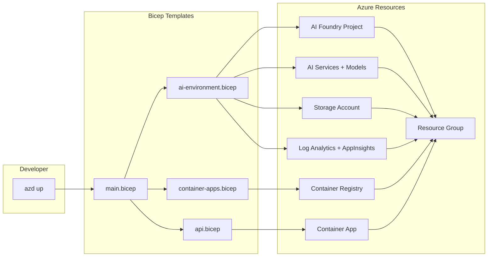
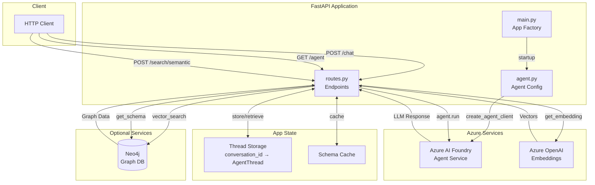
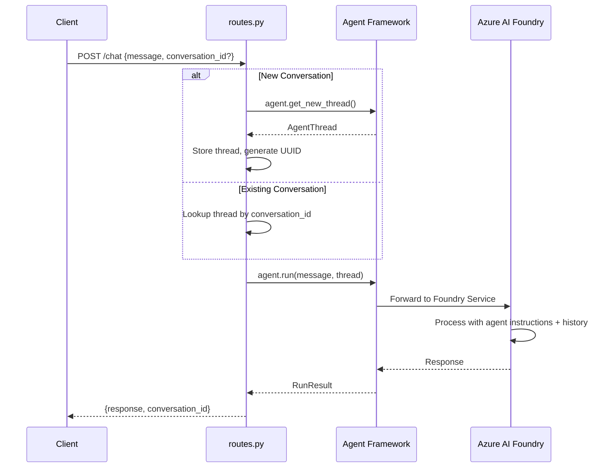

# Architecture

## Project Summary

- **Azure AI Agent Service API** built with FastAPI using the Microsoft Agent Framework (2025) with Azure AI Foundry integration
- Creates **persistent, service-managed AI agents** hosted in Azure AI Foundry with conversation memory via threads
- Exposes REST endpoints for agent chat (sync and streaming), agent metadata, and semantic search
- Includes optional **Neo4j graph database** integration for knowledge graph schema and **vector semantic search** with graph-aware context enrichment
- Uses **Azure Developer CLI (azd)** for infrastructure provisioning and deployment to Azure Container Apps
- Authenticates via Azure CLI credentials locally and Managed Identity in production

---

## What It Creates

### Azure Resources (via `azd up`)

| Resource | Purpose |
|----------|---------|
| **Azure AI Foundry Project** | Hosts the AI agent and model deployments |
| **Azure AI Services** | Provides GPT-4o chat and text-embedding-ada-002 embedding models |
| **Azure Container Apps** | Hosts the FastAPI application |
| **Azure Container Registry** | Stores Docker images for deployment |
| **Azure Storage Account** | Required by AI Foundry for agent state |
| **Log Analytics + App Insights** | Monitoring and telemetry |
| **Managed Identity** | Secure authentication for the container app |

### AI Agent

- A persistent agent named `arches-agent` (configurable) using `gpt-4o`
- Server-managed conversation threads stored in Azure AI Foundry
- System instructions defining agent behavior

---

## Technology Stack

| Layer | Technology | Purpose |
|-------|------------|---------|
| Cloud Platform | Azure | Hosts all infrastructure |
| AI Backend | Azure AI Foundry | Manages AI agents and model access |
| Agent SDK | Microsoft Agent Framework | Provides agent creation and conversation APIs |
| Web Framework | FastAPI | Handles HTTP requests |
| Production Server | Gunicorn + Uvicorn | Runs multiple worker processes |
| Container Platform | Azure Container Apps | Hosts the deployed application |
| Graph Database | Neo4j (optional) | Knowledge graph for semantic search |

---

## Infrastructure

### Deployment Architecture

The infrastructure is defined in Bicep templates under `infra/` and deployed via Azure Developer CLI:

```
infra/
├── abbreviations.json            # Resource naming abbreviations
├── main.bicep                    # Entry point - orchestrates all resources
├── main.parameters.json          # Default parameter values
├── api.bicep                     # Container App for the API
└── core/
    ├── host/
    │   ├── ai-environment.bicep          # AI Foundry + Storage + Monitoring
    │   ├── container-apps.bicep          # Container Apps Environment + Registry
    │   ├── container-apps-environment.bicep  # Container Apps Environment config
    │   ├── container-app.bicep           # Individual container app
    │   ├── container-app-upsert.bicep    # Container app create/update logic
    │   └── container-registry.bicep      # Azure Container Registry
    ├── ai/
    │   └── cognitiveservices.bicep   # AI Services + model deployments
    ├── monitor/
    │   ├── loganalytics.bicep        # Log Analytics workspace
    │   └── applicationinsights.bicep # Application Insights
    ├── storage/
    │   └── storage-account.bicep     # Storage for AI Foundry
    └── security/
        ├── role.bicep                # RBAC role assignments
        └── registry-access.bicep     # Container registry access roles
```

### Infrastructure Deployment Diagram



### Model Deployments

| Model | Type | SKU | Purpose |
|-------|------|-----|---------|
| `gpt-4o` | OpenAI | GlobalStandard | Chat completion for agent |
| `text-embedding-ada-002` | OpenAI | GlobalStandard | Embeddings for semantic search |

### Security & RBAC

The following roles are assigned automatically:

- **Azure AI Developer** - For creating and managing agents
- **Cognitive Services User** - For calling AI models
- **Azure AI User** - For project access
- **Storage Blob Data Contributor** - For AI Foundry state storage

### Environment Variables Exported

After provisioning, these variables are available:
- `AZURE_AI_PROJECT_ENDPOINT` - The Foundry project API endpoint
- `AZURE_AI_MODEL_NAME` - The deployed model name
- `AZURE_AI_EMBEDDING_NAME` - The embedding model deployment name
- `AZURE_AI_AGENT_NAME` - The agent's display name
- `AZURE_OPENAI_ENDPOINT` - Direct OpenAI endpoint for embeddings

---

## Azure AI Foundry

### What is Azure AI Foundry?

Azure AI Foundry is Microsoft's platform for building and deploying AI applications. It provides:

- **Project-based organization** - Group related AI resources together
- **Model deployments** - Deploy OpenAI and other models
- **Agent service** - Host persistent AI agents with server-managed threads
- **Connections** - Integrate with Azure OpenAI, storage, monitoring, etc.

### Agent Framework Integration

This project uses the **Microsoft Agent Framework (2025)** with Azure AI Foundry:

```python
from agent_framework.azure import AzureAIAgentClient

# Create client connected to Foundry project
client = AzureAIAgentClient(
    project_endpoint="https://<region>.api.azureml.ms/agents/v1.0/subscriptions/.../projects/...",
    model_deployment_name="gpt-4o",
    async_credential=AzureCliCredential()
)

# Create a persistent agent (stored in Foundry)
async with client.create_agent(name="arches-agent", instructions="...") as agent:
    thread = agent.get_new_thread()
    result = await agent.run("Hello!", thread=thread)
```

### Key Concepts

| Concept | Description |
|---------|-------------|
| **Project Endpoint** | URL identifying your AI Foundry project |
| **Agent** | Persistent entity with name, model, and instructions |
| **Thread** | Server-managed conversation history |
| **Run** | Single request/response interaction |

### Thread Persistence

- Threads are stored **server-side** in Azure AI Foundry
- Each thread has a `service_thread_id` for retrieval
- Conversation history is maintained across requests
- This app maps `conversation_id` (UUID) to `AgentThread` objects locally

---

## Application Architecture

### Component Overview

```
src/
├── api/
│   ├── main.py           # FastAPI app factory, lifespan management
│   └── routes.py         # REST endpoints
├── agent.py              # Agent configuration and client creation
├── neo4j_client.py       # Graph database client (optional)
├── vector_search.py      # Semantic search with embeddings (optional)
├── logging_config.py     # Logging setup
├── util.py               # Environment utilities
└── gunicorn.conf.py      # Production server config
```

### Data Flow Diagram



### Chat Request Sequence



### Startup Sequence

1. Load environment variables from `.env`
2. Create Azure CLI credentials for authentication
3. Create `AzureAIAgentClient` connected to Foundry
4. Create the agent using `create_agent()` context manager
5. Initialize Neo4j connection (optional, graceful fallback)
6. Initialize vector search client (optional)
7. Store all in FastAPI's application state
8. Register API routes and start accepting requests

---

## API Endpoints

| Endpoint | Method | Description |
|----------|--------|-------------|
| `/agent` | GET | Returns agent metadata (name, model, instructions) |
| `/chat` | POST | Send message, receive response with conversation tracking |
| `/chat/stream` | POST | Streaming chat response |
| `/search/semantic` | POST | Vector search with graph context (requires Neo4j) |
| `/search/schema` | GET | Returns cached graph schema (requires Neo4j) |

### POST /chat

Send a message and get a response. Accepts:
- `message` - The user's message (required)
- `conversation_id` - ID from a previous response to continue that conversation (optional)

Returns:
- `response` - The agent's reply
- `conversation_id` - Use this to continue the conversation

---

## Conversation Memory

### How It Works

1. First message creates a new `AgentThread` object
2. We generate a UUID as our `conversation_id` and store the thread
3. After `agent.run()`, the framework sets `thread.service_thread_id` with Foundry's thread ID
4. On subsequent requests with the same `conversation_id`, we retrieve and reuse the thread
5. Foundry maintains the full conversation history server-side

### Storage

Currently threads are stored in memory (a Python dictionary). This means:
- Conversations persist while the server is running
- Restarting the server loses local thread mappings
- For production, replace with Redis or a database

---

## Environment Variables

### Required

| Variable | Description |
|----------|-------------|
| `AZURE_AI_PROJECT_ENDPOINT` | Azure AI Foundry project endpoint URL |

### Optional

| Variable | Default | Description |
|----------|---------|-------------|
| `AZURE_AI_AGENT_NAME` | `arches-agent` | Name of the agent |
| `AZURE_AI_MODEL_NAME` | `gpt-4o` | Model deployment name |
| `AZURE_AI_EMBEDDING_NAME` | - | Embedding model deployment |
| `AZURE_OPENAI_ENDPOINT` | - | Azure OpenAI endpoint for embeddings |
| `NEO4J_URI` | - | Neo4j connection URI |
| `NEO4J_USERNAME` | - | Neo4j username |
| `NEO4J_PASSWORD` | - | Neo4j password |
| `APP_LOG_FILE` | - | Optional log file path |

---

## Deployment

### Local Development

1. Run `azd up` to provision infrastructure
2. Run `uv run setup_env.py` to pull environment variables
3. Run `uv run uvicorn api.main:create_app --factory --reload`

### Production (Azure Container Apps)

1. Docker builds the image using the `Dockerfile`
2. `azd deploy` pushes to Container Registry and updates the Container App
3. Gunicorn runs multiple Uvicorn workers for concurrency
4. Environment variables are injected from the Bicep configuration

---

## Authentication

### Local Development

Uses `AzureCliCredential` - requires running `az login` first.

### Production

Uses managed identity (`AZURE_CLIENT_ID` environment variable). The Container App's identity has roles assigned to access AI Services.

---

## Key Design Principles

1. **Service-Managed Agents** - Agents persist in Azure AI Foundry, not created per request
2. **Conversation Threading** - Server-side thread storage maintains context across requests
3. **Graceful Degradation** - App works without Neo4j/vector search if not configured
4. **Async-First** - All I/O operations are async for scalability
5. **Infrastructure as Code** - Full Azure setup via Bicep and azd
6. **Managed Identity** - Secure, credential-free auth in production

---

## References

- [Microsoft Agent Framework](https://github.com/microsoft/agent-framework)
- [Azure AI Foundry](https://learn.microsoft.com/en-us/azure/ai-foundry/)
- [Azure Developer CLI](https://learn.microsoft.com/en-us/azure/developer/azure-developer-cli/)
