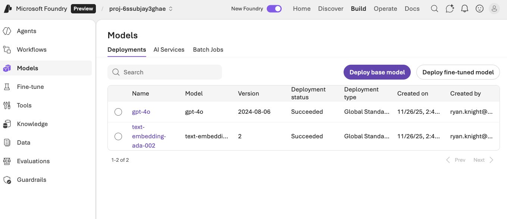
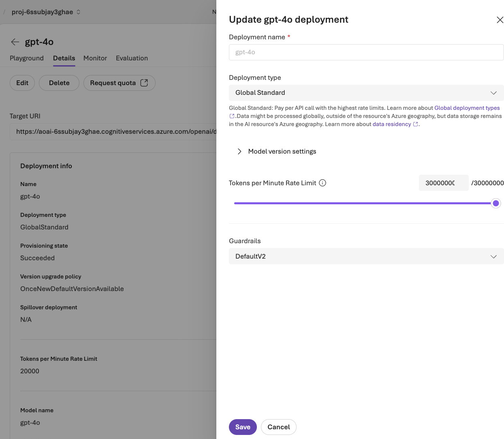

# Agent Framework Workshops with Neo4j GraphRAG

These workshops demonstrate how to build AI agents using the Microsoft Agent Framework with Azure AI Foundry, integrated with Neo4j graph database capabilities via the neo4j-graphrag-python library.

## Prerequisites

Before running setup, ensure you have a `.env` file in the **project root** with the following variables:
If using Azure deployment, you can generate this file with `uv run setup_env.py` from the project root.

## Quick Start

Run the setup script to install dependencies, register the Jupyter kernel, and test connections:

```bash
cd new-workshops
./setup.sh
```

This script will:
1. Install [uv](https://github.com/astral-sh/uv) if not already installed
2. Install Python dependencies
3. Register a Jupyter kernel named "neo4j-jupyter-kernel"
4. Test Neo4j and Azure AI connections

> **Important (Codespaces/Dev Containers):** After running `setup.sh`, you must **refresh your browser** (or run "Developer: Reload Window" from the command palette) for VS Code to detect the new Jupyter kernel.

## CRITICAL: Increase Azure AI Token Quota

Before running the workshops, you **must** increase the token rate limits for your Azure AI model deployments, or you will encounter rate limiting errors.

1. Go to [https://ai.azure.com/](https://ai.azure.com/)
2. Click **Build** in the top navigation bar
3. Select your project and click **Models** in the left sidebar



4. Click on **gpt-4o** in the model list
5. Click the **Details** tab
6. Click **Edit** to open the deployment settings
7. Find the **Tokens per Minute Rate Limit** slider and turn the volume up to 11 (set it to the maximum available)



8. Click **Save** to apply the changes

Do the same thing for **text-embedding-ada-002** - click on it, go to Details, click Edit, and max out the token rate limit.

## Jupyter Notebooks

Interactive notebooks are available in the `notebooks/` directory for hands-on learning:

### Retriever Workshops (01_xx)

These notebooks demonstrate RAG patterns using neo4j-graphrag with Azure AI Foundry:

- **01_01_vector_retriever.ipynb** - Basic vector search and GraphRAG pipeline
- **01_02_vector_cypher_retriever.ipynb** - Vector search with custom Cypher for richer context
- **01_03_text2cypher_retriever.ipynb** - Natural language to Cypher query generation

### Agent Workshops (02_xx)

These notebooks demonstrate the Microsoft Agent Framework with Azure AI Foundry:

- **02_01_simple_agent.ipynb** - Basic agent with schema retrieval tool
- **02_02_vector_graph_agent.ipynb** - Agent with vector search and graph traversal
- **02_03_text2cypher_agent.ipynb** - Multi-tool agent with schema, vector, and Text2Cypher tools

To run notebooks:
```bash
cd new-workshops
uv run jupyter notebook notebooks/
```

## Python Solutions

Complete Python scripts are available in the `solutions/` directory:

### 01_01: Vector Retriever

Basic vector retriever using semantic search over Neo4j.

```bash
uv run python solutions/01_01_vector_retriever.py
```

### 01_02: Vector Cypher Retriever

Enhanced retriever with custom Cypher queries for graph traversal.

```bash
uv run python solutions/01_02_vector_cypher_retriever.py
```

### 01_03: Text2Cypher Retriever

Natural language to Cypher query generation.

```bash
uv run python solutions/01_03_text2cypher_retriever.py
```

### 02_01: Simple Agent

A basic agent with a single tool to retrieve the graph database schema.

```bash
uv run python solutions/02_01_simple_agent.py
```

### 02_02: Vector + Graph Agent

An agent with vector search that retrieves documents and traverses the graph for context.

```bash
uv run python solutions/02_02_vector_graph_agent.py
```

### 02_03: Multi-Tool Agent with Text2Cypher

An agent with three tools: schema retrieval, vector search, and natural language to Cypher queries.

```bash
uv run python solutions/02_03_text2cypher_agent.py
```

## Architecture

These workshops use:

- **Microsoft Agent Framework** - For agent creation and tool management
- **Azure AI Foundry** - For model hosting (via AzureAIAgentClient)
- **neo4j-graphrag-python** - For graph retrieval capabilities
- **Neo4j** - For graph database storage and vector search

## File Structure

```
new-workshops/
├── pyproject.toml          # Dependencies using uv
├── README.md               # This file
├── notebooks/              # Jupyter notebooks for interactive learning
│   ├── 01_01_vector_retriever.ipynb
│   ├── 01_02_vector_cypher_retriever.ipynb
│   ├── 01_03_text2cypher_retriever.ipynb
│   ├── 02_01_simple_agent.ipynb
│   ├── 02_02_vector_graph_agent.ipynb
│   └── 02_03_text2cypher_agent.ipynb
└── solutions/
    ├── __init__.py
    ├── config.py                    # Shared configuration utilities
    ├── 01_01_vector_retriever.py    # Vector retriever solution
    ├── 01_02_vector_cypher_retriever.py  # Vector Cypher retriever solution
    ├── 01_03_text2cypher_retriever.py    # Text2Cypher retriever solution
    ├── 02_01_simple_agent.py        # Basic agent with schema tool
    ├── 02_02_vector_graph_agent.py  # Agent with vector search
    └── 02_03_text2cypher_agent.py   # Multi-tool agent with text2cypher
```
